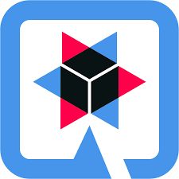

## About me
- I am Mathis Burger, I am 19 years old.
- My main programming languages are Go, Rust, TypeScript and PHP
- Furthermore I am using a ton of different frameworks for my projects

**Main Languages and Frameworks:** 
 &nbsp;&nbsp;
 &nbsp;&nbsp;
 &nbsp;&nbsp;
 &nbsp;&nbsp;
 &nbsp;&nbsp;
 &nbsp;&nbsp;
 &nbsp;&nbsp;
 &nbsp;&nbsp;
 &nbsp;&nbsp;

**Tools:** 
 &nbsp;&nbsp;
 &nbsp;&nbsp;
 &nbsp;&nbsp;
 &nbsp;&nbsp;
 &nbsp;&nbsp;
 &nbsp;&nbsp;

**Currently learning:** 
 &nbsp;&nbsp;
 &nbsp;&nbsp;
 &nbsp;&nbsp;

**GitHub Stats:**

  

  
  

